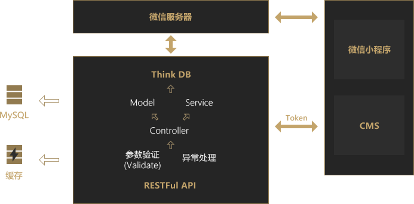

# flask-server
this is a project for flask server

#### 开发
基于vscode+remote container 或者remote ssh

* 在remote container 安装python插件

* 安装pipenv
```bash
pip install pipenv -i https://mirrors.aliyun.com/pypi/simple
```
* 安装库
```bash
# 创建虚拟环境
pipenv install --pypi-mirror https://mirrors.aliyun.com/pypi/simple

# 修改pipfile
[[source]]
name = "pypi"
url = "https://pypi.org/simple"
verify_ssl = true

[dev-packages]

[packages]

[requires]
python_version = "3.7"
# 为
[[source]]
name = "pypi"
url = "https://mirrors.aliyun.com/pypi/simple"
verify_ssl = true

[dev-packages]

[packages]

[requires]
python_version = "3.7"

# 安装库
pipenv install
```
#### 使用
> 目前代码中提供的wx和setting的某配置是不可用的，使用者须更换为自己的配置
```bash
# 开发使用
# 使用docker-compose.yml方式运行
# 端口映射8010，访问本机地址8010即可

# 启动flask和mysql容器
docker-compose up -d
# 进入flask容器运行flask-server启动命令
python shema.py run -h 0.0.0.0 -p 8010 # 已过期
# 使用flask-scrip启动
pipenv run python manage.py runserver
# 使用Gunicorn启动
pipenv run gunicorn -w 4 -b 0.0.0.0:8010 manage:app

# 如果不使用docker进行开发和部署，可用:
1.安装mysql，修改setting中数据库连接的url为自己数据库的配置
2.pipenv install 安装包
3.正常启动flask=server启动命令

# 注册和登录
目前提供三种登录方式
1.邮箱
2.微信小程序
3.微信第三方登录
```
#### 部署
* 使用[docker-nginx](https://github.com/linrong/docker-nginx)([nginx-proxy](https://github.com/jwilder/nginx-proxy)+[docker-letsencrypt-nginx-proxy-companion](https://github.com/JrCs/docker-letsencrypt-nginx-proxy-companion))作为ssl认证和反向代理服务器，进行ssl的自动配置和容器的动态接入和移除，另外作为静态文件服务器
* 使用flask+gunicorn运行后端服务器，通过容器编排进行容器间的通信

#### 模块
> 主要按照在使用的技术可以划分的模块
* 视图(包括自定义红图和蓝图)
* 配置
* 数据(异常处理，数据的序列化，数据的检查)
* 访问认证和权限划分
* model和orm
* flask模块
* swagger
* wx

> 架构



#### 接口文档
* [Swagger](https://swagger.io/) 是一个规范和完整的框架，用于生成、描述、调用和可视化 RESTful 风格的 Web 服务。
* 本项目使用[flasgger库](https://github.com/rochacbruno/flasgger)自动生成 Swagger风格[(Demo)](https://editor.swagger.io/?_ga=2.211085136.492521077.1539840591-1920768432.1536803925)的API文档。
* [Swagger Editor](http://editor.swagger.io/) 在网页端直接编辑 API文档
* 查阅API文档
> 在浏览器端输入：http://localhost:8010/apidocs/#/

#### 特色
* 基于原生的Flask构建RESTfull API
* AOP(面向切面编程)设计，实现参数校验层&异常统一处理层
* 更灵活的 API文档生成方式

#### 参考资料
* [Flask 上传文件](https://dormousehole.readthedocs.io/en/latest/patterns/fileuploads.html)
* [Nginx的https配置记录以及http强制跳转到https的方法梳理](https://www.cnblogs.com/kevingrace/p/6187072.html)
* [深入Python Flask构建Restful API 或者 慕课网 Python Flask构建可扩展的 ESTful API](https://www.os4team.cn/)
* [labike.github.io](https://github.com/labike/labike.github.io/issues/45)
* [mini-shop-server](https://github.com/Allen7D/mini-shop-server)
* [flask-restful-example](https://github.com/qzq1111/flask-restful-example)
* [python+Django实现微信小程序支付功能(不用SDK)](https://blog.csdn.net/qq_34493908/article/details/81190057)
* [wechatpy(微信的第三方 Python SDK) 使用文档](http://docs.wechatpy.org/zh_CN/master/index.html)
* [lin-cms-flask](https://github.com/TaleLin/lin-cms-flask)

### 最后
有问题请[issue](https://github.com/linrong/flask-server/issues)提问。

如果觉得还不错的话，就给个 [Star](https://github.com/linrong/flask-server) ⭐️ 鼓励一下我吧~